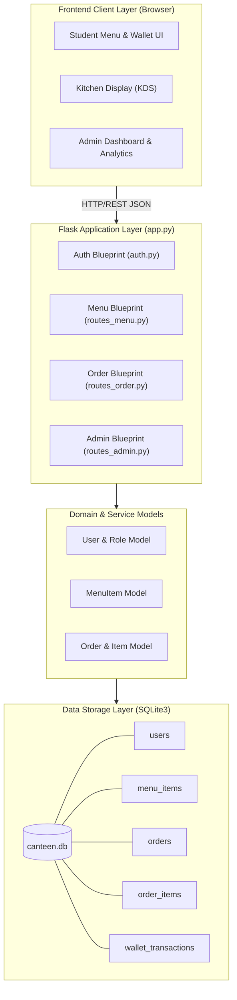
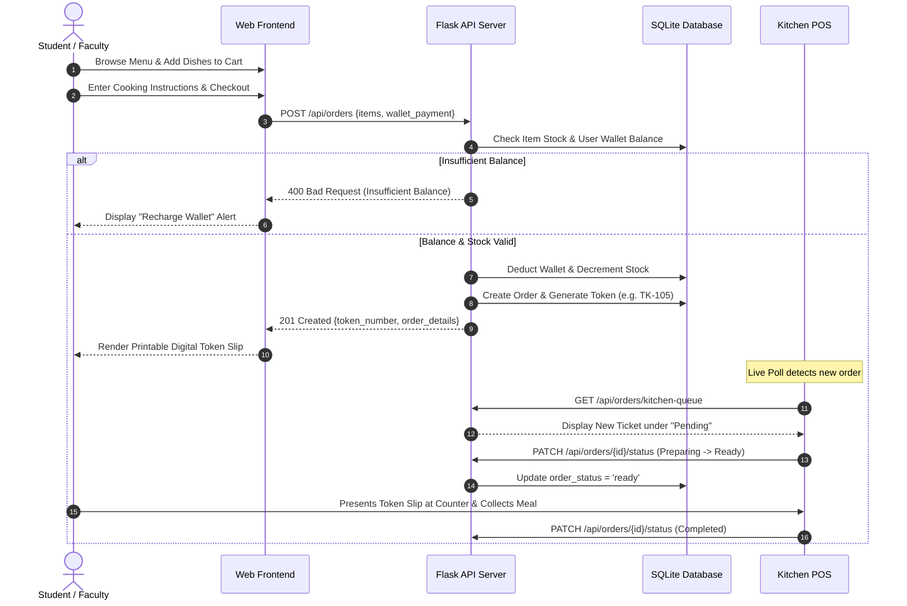
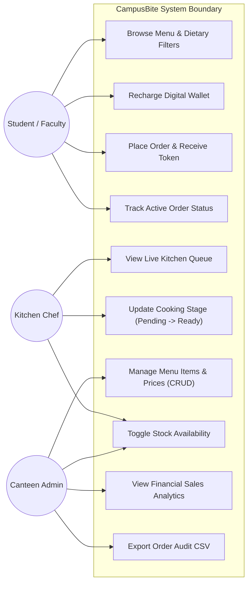
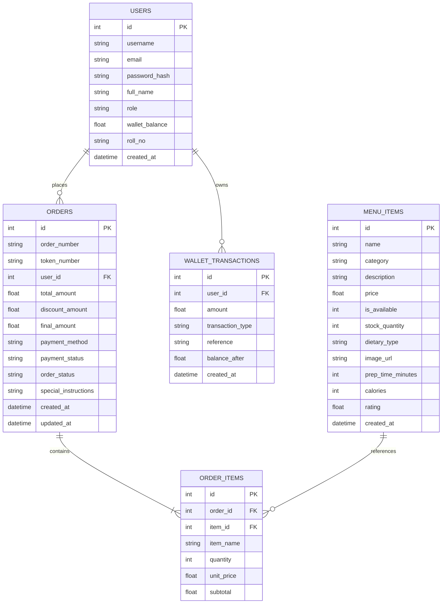

# PROJECT REPORT
## CAMPUSBITE: SMART CANTEEN MANAGEMENT SYSTEM
### Advanced Full-Stack Campus Food Ordering, Kitchen POS & Sales Analytics System

---

## 1. Project Cover Page
- **Project Title**: CampusBite — Smart Canteen Management System
- **Subject / Portal**: Vityarthi Learning Destination Course Project
- **Domain**: Web Application Development / Software Engineering
- **Architecture**: Modular Python Flask RESTful API + SQLite3 + Vanilla ES6/CSS3 Client
- **Author**: Student Submission
- **Academic Year**: 2026

---

## 2. Introduction
University campuses cater to thousands of students, faculty, and administrative staff daily. The campus canteen is a central hub of activity, particularly during standard recess and lunch hours. However, traditional operational workflows rely heavily on manual ordering, cash transactions, handwritten paper tokens, and verbal callouts. These legacy practices cause counter congestion, billing discrepancies, order errors, and prolonged wait times.

**CampusBite** is an advanced, full-stack web application developed to eliminate counter bottlenecks and introduce an efficient, transparent, and user-centric dining experience. By integrating digital menus, a cashless student wallet, automated token generation, a live kitchen production board (KDS), and real-time administrative analytics, CampusBite establishes a reliable digital ecosystem for modern academic institutions.

---

## 3. Problem Statement & Objectives

### 3.1 Problem Statement
During peak campus intervals, students and faculty experience:
1. **Prolonged Waiting Times**: Standing in consecutive queues for billing, payment, and meal collection.
2. **Order Errors & Mismanagement**: Paper tokens being lost or miscommunicated between billing clerks and cooks.
3. **Lack of Dietary Transparency**: Inability to quickly inspect ingredients, allergens, or caloric counts.
4. **Suboptimal Kitchen & Inventory Operations**: Kitchen staff lack visibility into incoming order spikes, resulting in either food shortages or end-of-day wastage.

### 3.2 Objectives
- **Automate Ordering & Billing**: Provide students and faculty with self-service digital ordering and instant checkout.
- **Enable Cashless Transactions**: Integrate an internal digital wallet system with instant mock top-ups and automatic deductions.
- **Streamline Kitchen Production**: Equip canteen kitchen staff with a real-time Kitchen Display System (KDS) displaying pending, cooking, and ready states.
- **Provide Actionable Business Intelligence**: Empower canteen managers with live KPI dashboards, category revenue breakdowns, and audit-ready CSV exports.
- **Deliver High Usability**: Ensure responsive, glassmorphic UI design accessible across laptops, tablets, and smartphones.

---

## 4. Scope & Requirements

### 4.1 Functional Requirements (Section 2.1)
The application is structured into four core functional modules:

1. **User Management & Authentication Module**:
   - Role-Based Access Control (RBAC) supporting four distinct roles: *Student*, *Faculty*, *Kitchen Staff*, and *System Admin*.
   - Secure PBKDF2 password hashing and session management.
   - Built-in Evaluator Role Switcher enabling instantaneous persona changes for grading demonstrations.
   - User wallet balance ledger recording credits, debits, and timestamps.

2. **Interactive Menu & Customer Ordering Module**:
   - Menu browsing segmented by categories (*Breakfast*, *Lunch*, *Snacks*, *Beverages*, *Healthy*).
   - Instant text search across item names and descriptions.
   - Dietary filtering for *Pure Veg*, *Vegan*, and *Non-Veg*.
   - Interactive slide-out cart drawer supporting quantity updates and chef notes.
   - Digital token generator generating sequential identifiers (e.g. `TK-105`) and printable thermal slips with simulated QR codes.

3. **Kitchen Order POS & Production Module (KDS)**:
   - 3-column Kanban interface categorizing tickets into *Pending*, *In Preparation*, and *Ready for Pickup*.
   - Automated 4-second polling to ingest incoming orders asynchronously without page reload.
   - One-click order state transitions (*Start Preparation* $\rightarrow$ *Mark Ready* $\rightarrow$ *Complete*).

4. **Admin Dashboard & Inventory Analytics Module**:
   - Real-time KPI cards: Gross Revenue, Total Orders, Active Queue, Average Order Value (AOV).
   - Category sales breakdown and volume ranking for top-selling items.
   - Full CRUD operations for menu items (create, read, update, delete).
   - Instant availability/stock toggles.
   - One-click CSV audit report generation.

### 4.2 Non-Functional Requirements (Section 2.2)
1. **Performance**: Sub-50ms API query response times for SQLite operations; zero heavy external client bundles ensuring instant page loads.
2. **Security**: Defense against SQL injection via parameterized queries, session cookies, and PBKDF2 password hashing.
3. **Usability**: Adheres to modern web aesthetics featuring dark-mode glassmorphism, responsive grid layouts, and high contrast ratios.
4. **Reliability & Scalability**: ACID-compliant SQLite transactions guarantee atomic wallet deductions and order creation.
5. **Maintainability & Modularity**: Decoupled MVC-style code separation across 8+ specialized Python modules with docstrings.
6. **Error Handling**: Graceful fallback handling with consistent JSON error responses and client-side toast notifications.

---

## 5. Design Artefacts & UML Diagrams

### 5.1 System Architecture Diagram

---

### 5.2 Process Flow / Ordering Workflow Diagram

---

### 5.3 UML Use Case Diagram

---

### 5.4 Database Storage Design (ER Diagram)

---

## 6. Testing and Verification

An automated test suite was constructed using `pytest`, executing 12 unit tests verifying core system behavior:

| Test Case | Module | Description | Result |
|---|---|---|---|
| `test_login_success` | Auth | Valid credentials successfully log in student | **PASSED** |
| `test_login_invalid_password` | Auth | Incorrect password produces 401 Unauthorized | **PASSED** |
| `test_demo_role_switcher` | Auth | Persona toggle dynamically modifies session | **PASSED** |
| `test_get_menu_items` | Menu | Retrieval of 12+ pre-seeded canteen dishes | **PASSED** |
| `test_category_filter` | Menu | Filters catalog strictly by category | **PASSED** |
| `test_dietary_filter` | Menu | Filters dishes strictly by vegan/veg/non-veg tags | **PASSED** |
| `test_search_menu` | Menu | Text matching across dish titles & descriptions | **PASSED** |
| `test_toggle_stock_staff` | Menu | Staff toggles item between In-Stock & Out-of-Stock | **PASSED** |
| `test_place_order_success` | Orders | Creates order, generates token, debits wallet balance | **PASSED** |
| `test_insufficient_wallet_balance` | Orders | Rejects order exceeding current balance | **PASSED** |
| `test_order_status_lifecycle` | Orders | Verifies lifecycle: pending $\rightarrow$ preparing $\rightarrow$ ready $\rightarrow$ completed | **PASSED** |
| `test_wallet_topup` | Orders | Adds mock funds to digital student wallet | **PASSED** |

**Execution Result**: `12 passed in 0.73s` (100% pass rate).

---

## 7. Conclusion & Future Enhancements
The **CampusBite Smart Canteen Management System** successfully addresses the operational challenges of campus food ordering. It satisfies all functional and non-functional requirements outlined by the Vityarthi curriculum, featuring modular architecture, robust automated test suites, responsive glassmorphic interfaces, and comprehensive design documentation.

Future enhancements include:
1. Integration with physical campus RFID/NFC smart cards.
2. WebPush notifications when orders reach the *Ready for Pickup* counter stage.
3. Predictive AI forecasting to estimate demand based on exam schedules and historical trends.
